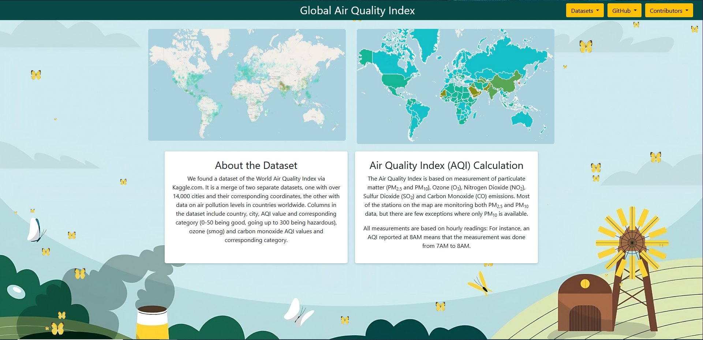
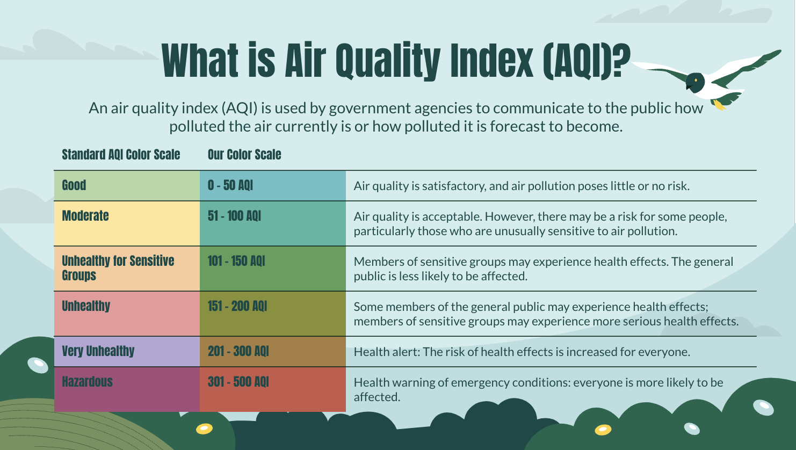
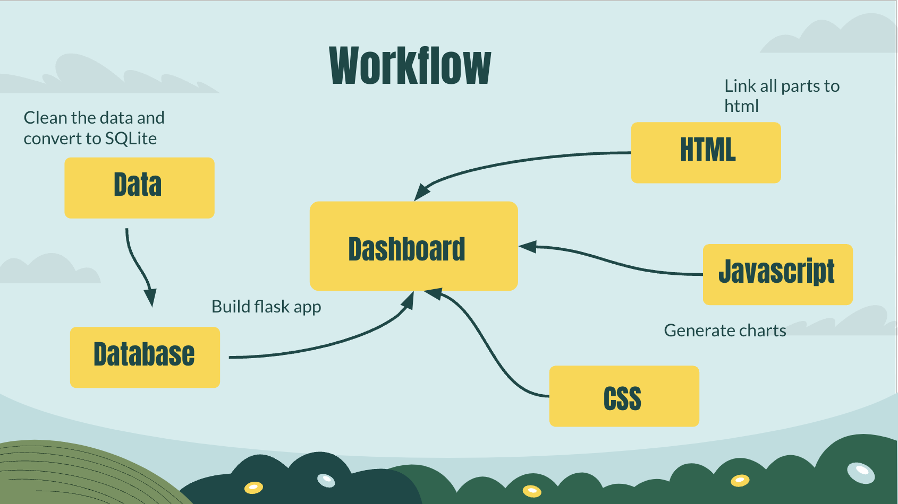

# Group_Project_3

###### Contributers of this project (alphabetical order):

* Chase Reynolds
* Irena Mehic
* Jae Zakarauskas
* Joanna Gromek
* Ning Gao
* Yanqiu Yang

### **Project Title:** World Air Quality Visualization

### Project Description:

##### 1.What our application does

An interactive global map showing the World Air Quality Index via Kaggle.com, a merge of two seperate datasets, one with over 14,000 cities and their corresponding coordinates, the other with date on air pollution levels in countries worldwide.

* `A heat map` to show the air quality index based on the standard AQI Color Scale (We changed the color scale to make it look better), with a dropdown menu to choose different country. When you choose the specific country, you can also see the detailed AQI info in that country.

* `A choropleth map` that user can click on the country to see the detailed info of each country's AQI information.

##### 2.What technology we used:

using the flask app to connect data and

### Project Progress:

1.The *propoal* and *sketch* of the final design: [click here to view](https://docs.google.com/document/d/1Uli1vOUb7PEUKXBcVxqaCytV_qjJDPO5XU5dzwbJ1nw/edit)

2.Our Powerpoint of the Final Presentation: [click here to view](https://docs.google.com/presentation/d/1kvcP9HexeMtknjB-pfObAaPZ7VYi2Y6oQ0_z3h6_T6s/edit#slide=id.g157f507e881_0_22)

### Some of the features we hope to implement in the future:

* Forest fire data would be useful since the smoke has a dramatic impact on air pollution. Create a heat map showing real time forest fires

* Global deforestation data shows when vast areas of trees are stripped, and stored carbon dioxide is released into the atmosphere. Deforestation contributes to 15% of greenhouse gas emissions. Create a heat map showing real time global deforestation data.
* Investigate global livestock datasets because farming and the food industry is a major contributor to air pollution.
* More specific data on the effects of manufacturing and burning of fossil fuels
* SO2 data was not included in the data set, but it’s a major pollutant in air quality
